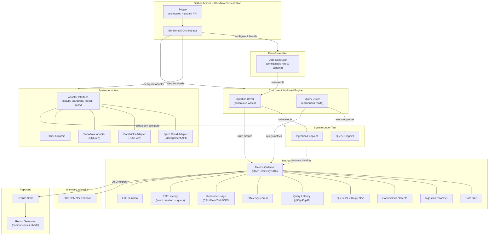

# Spicebench

A benchmark for data & AI platforms focused on operational data. Unlike static benchmarks such as ClickBench or TPC-H that run queries on pre-created datasets, Spicebench measures end-to-end performance across dynamic real-time data generation, ingestion, indexing/acceleration/materialization, and query execution — all running concurrently.

## Architecture

### Component Overview

| Component                       | Responsibility                                                                                                                                                                       |
| ------------------------------- | ------------------------------------------------------------------------------------------------------------------------------------------------------------------------------------ |
| **GitHub Actions Orchestrator** | Triggers benchmark runs on schedule, PR, or manual dispatch. Manages the full lifecycle: provision → run → collect → report → teardown.                                              |
| **Data Generator**              | Produces realistic operational data at configurable rates and schemas. Emits timestamped events for E2E latency measurement.                                                         |
| **System Adapters**             | Pluggable interface for provisioning and interacting with each platform. Each adapter implements `setup`, `teardown`, `ingest`, and `query` operations using platform-specific APIs. |
| **Concurrent Workload Engine**  | Drives continuous ingestion and query execution in parallel, simulating real operational workloads where reads and writes happen simultaneously.                                     |
| **Metrics Collector**           | Emits all benchmark metrics via OpenTelemetry (OTLP) to `telemetry.spiceai.io`. Captures data from both the workload drivers and the system under test.                              |
| **Report Generator**            | Aggregates results and produces cross-system comparisons.                                                                                                                            |

### Metrics

| Metric                | Description                                                            |
| --------------------- | ---------------------------------------------------------------------- |
| Data Size             | Total volume of data ingested during the benchmark run                 |
| Ingestion records/s   | Sustained ingestion throughput                                         |
| Connections / Clients | Number of concurrent connections maintained                            |
| Queries/s, Requests/s | Query throughput under concurrent ingestion load                       |
| Query Latency         | Per-query performance breakdown (p50, p95, p99) across the query suite |
| Efficiency (cores)    | Performance normalized by compute resources                            |
| Resource Usage        | CPU, memory, disk, and IOPS utilization during the run                 |
| E2E Latency           | Time from event creation to the event being queryable                  |
| E2E Duration          | Total wall-clock time for the full benchmark run                       |

### Adding a New System Adapter

To benchmark a new platform, implement the adapter interface:

1. **Setup** — Provision infrastructure and configure the target system (e.g., via [Spice Cloud Management API](https://docs.spice.ai/api/management) or Databricks REST API).
2. **Ingest** — Write generated events to the system's ingestion endpoint.
3. **Query** — Execute the benchmark query suite against the system.
4. **Teardown** — Clean up provisioned resources.

## License

See [LICENSE](LICENSE) for details.
