# SpiceBench

A benchmark for data & AI platforms that operate on a hybrid data lake + database architecture — where data streams continuously from lakes, databases, and APIs into both object-stores and databases that serves low-latency queries for applications and AI agents. Unlike static benchmarks such as ClickBench or TPC-H that run queries on pre-created datasets, SpiceBench measures end-to-end performance across the full operational lifecycle: real-time data generation, ingestion, indexing/acceleration/materialization, and concurrent query execution.

## Documentation

Detailed documentation is available in the [`docs/`](docs/) directory:

| Document                                                 | Description                                                         |
| -------------------------------------------------------- | ------------------------------------------------------------------- |
| [Architecture](docs/architecture.md)                     | System architecture, run lifecycle, benchmark phases, and data flow |
| [Getting Started](docs/getting-started.md)               | Installation, prerequisites, and first run                          |
| [CLI Reference](docs/cli-reference.md)                   | Complete `spicebench`, `data-generation`, and `etl` CLI flags       |
| [System Adapters](docs/system-adapters.md)               | JSON-RPC 2.0 protocol, transport modes, and building new adapters   |
| [Data Generation & ETL](docs/data-generation-and-etl.md) | Dataset generation, ETL pipeline, sinks, and checkpointing          |
| [Metrics & Telemetry](docs/metrics-and-telemetry.md)     | All OTel instruments, streaming metrics, and Grafana dashboards     |
| [Configuration](docs/configuration.md)                   | Configuration format, query sets, and SQL dialect overrides         |
| [Crate Reference](docs/crate-reference.md)               | Per-crate API overview for all workspace crates                     |

## Goals

The main goals of SpiceBench are:

### Realism

Modern data platforms don't just run analytical queries on static tables — they combine a data lake (the scalable source of truth) with an acceleration or materialization layer that serves low-latency queries to applications and AI agents. SpiceBench targets this hybrid architecture directly. It generates and streams data continuously into the system under test while concurrently executing query workloads, capturing the real tension between ingestion throughput, materialization freshness, and query latency that operators face every day.

### Reproducibility

Every Run is fully automated and deterministic: a single `spicebench` invocation provisions the system under test, loads data, executes the benchmark, collects metrics, and tears down infrastructure. All results are published to [SpiceBench.com](https://spicebench.com) with full metadata — executor instance type, scale factor, query set, and system adapter version — so any result can be reproduced on equivalent hardware.

### Extensibility

Adding a new system takes one adapter — a JSON-RPC 2.0 process (stdio or HTTP) implementing four methods (`setup`, `create_tables`, `teardown`, `metrics`). Starter templates are provided in Python, Node.js, Rust, Go, and Java. No source-code changes to SpiceBench are required.

### Transparency

All metrics are emitted via OpenTelemetry with well-defined instruments. Raw per-query latencies, ingestion rates, resource utilization, and pass/fail verdicts are available for every Run. The scoring methodology (E2E wall-clock time as primary rank, p99 regression detection for pass/fail) is documented and auditable.

## Limitations

SpiceBench focuses on a specific class of workloads — concurrent data ingestion with analytical query execution. Note these limitations:

1. **Hybrid architecture bias.** The benchmark is designed for systems that combine a data lake or federated source layer with an acceleration/materialization layer for low-latency serving. Pure batch-analytical warehouses and pure OLTP databases are not the target workload and may be at an unfair disadvantage.

2. **Dataset coverage.** The data generator currently produces TPC-H tables, with ClickBench and custom dataset support planned. While TPC-H covers common analytical patterns, it does not represent all real-world data shapes (e.g., time-series, JSON, graph) — additional datasets will expand workload diversity over time.

3. **Scale factor range.** Default runs use modest scale factors that complete in minutes. This allows fast iteration but may not surface bottlenecks that appear only at terabyte scale.

4. **Hardware variance.** Results depend heavily on the executor instance type and the SUT deployment. SpiceBench records instance metadata and encourages apples-to-apples comparisons, but cross-hardware conclusions should be drawn carefully.

5. **No cost modeling.** The benchmark does not measure cloud spend, pricing, or cost-efficiency. Two systems may achieve similar throughput at vastly different price points.

*All Benchmarks Are Liars* — use SpiceBench results as one signal among many, not as an absolute verdict.

## Future Ideas: Toward a Fully AI-Native Benchmark

Today, SpiceBench focuses on operational data-plane performance from ingestion to query execution.

The next major extension is to benchmark the full AI-native path from **data ingestion to prompt/RAG outcomes**. Planned areas include:

- **Text-to-SQL evaluation** — measure generation quality, execution success rate, latency, and semantic correctness against ground-truth query intent.
- **Search & retrieval evaluation** — benchmark hybrid retrieval quality (keyword + vector), recall@k / nDCG, retrieval latency, and freshness under continuous ingest.
- **Context engineering evaluation** — measure context assembly quality (chunking, ranking, grounding, citation coverage), token efficiency, and end-to-end response readiness latency.
- **Ingestion-to-answer freshness** — track the time from source event creation to the event being usable in retrieval and reflected in generated answers.

This extends SpiceBench from ingestion-to-query into ingestion-to-prompt/RAG, so teams can evaluate real AI application behavior, not only SQL query speed.

## Architecture

```mermaid
flowchart TB
    subgraph GHA["GitHub Actions – Workflow Orchestration"]
        direction TB
        trigger["Trigger\n(schedule / manual / PR)"]
        orchestrator["Benchmark Orchestrator"]
        trigger --> orchestrator
    end

    subgraph run["SpiceBench Run"]
        direction TB

        subgraph setup_phase["1 · Setup (JSON-RPC)"]
            adapter_iface["System Adapter Protocol\n(setup / create_tables /\nteardown / metrics)"]
            spice["Adapter A"]
            databricks["Adapter B"]
            other["System Adapters\n(pluggable via JSON-RPC)"]
            adapter_iface --- spice
            adapter_iface --- databricks
            adapter_iface --- other
        end

        subgraph bench_phase["2 · Benchmark (timed)"]
            direction TB

            subgraph query_exec["Query Execution"]
                direction LR
                warmup["Warm-up\n(1× query set)"]
                baseline["Baseline\n(10% duration,\n60s–600s)"]
                loadtest["Load Test\n(full duration,\nconcurrent clients)"]
                warmup --> baseline --> loadtest
            end

            subgraph executors["Query Executors"]
                direction TB
                adbc_exec["ADBC Direct\n(adapter-selected driver)"]
                http_exec["HTTP\n(/v1/sql)"]
                distributed_exec["Distributed\n(/v1/queries)"]
            end

            subgraph sut["System Under Test"]
                direction TB
                query_ep["Query Endpoint"]
            end

            query_exec -->|"execute queries"| executors
            executors -->|"SQL queries"| query_ep
        end

        subgraph teardown_phase["3 · Teardown"]
            cleanup["Deprovision resources\nvia adapter JSON-RPC"]
        end
    end

    subgraph datagen["Data Generation (standalone)"]
        direction TB
        generator["data-generation binary\n(TPC-H datasets)"]
        s3target["S3 Target\n(Parquet batches)"]
        generator -->|"write batches"| s3target
    end

    subgraph metrics["Metrics Collection (OTel)"]
        direction TB
        collector["OpenTelemetry SDK"]
        m_query["Per-Query Metrics\n(iterations, median/min/max/p99\nduration, pass/fail status)"]
        m_throughput["Throughput\n(queries/s, queries total)"]
        m_ingestion["Ingestion (from SUT adapter)\n(rows, bytes, rows/s)"]
        m_resource["Resource Usage (from SUT adapter)\n(CPU%, memory, disk R/W,\ndisk IOPS)"]
        m_health["Health Probes\n(/health, /v1/ready latency)"]
        m_memory["Memory\n(peak/median usage)"]
        m_efficiency["Efficiency\n(queries/s per core)"]
        m_e2e["E2E Duration\n(benchmark wall-clock time)"]
        collector --- m_query
        collector --- m_throughput
        collector --- m_ingestion
        collector --- m_resource
        collector --- m_health
        collector --- m_memory
        collector --- m_efficiency
        collector --- m_e2e
    end

    subgraph streaming["Streaming Metrics (optional)"]
        streaming_exporter["StreamingOtlpExporter\n(every 5s to --otlp-endpoint)"]
    end

    subgraph telemetry["telemetry.spiceai.io"]
        direction TB
        arrow_endpoint["Arrow Flight Endpoint"]
        otel_endpoint["OTLP Endpoint\n(--otlp-endpoint)"]
    end

    subgraph website["SpiceBench.com"]
        leaderboard["Leaderboard\n(ranked by E2E benchmark duration)"]
        run_details["Run Details\n(per-query breakdown,\nresource usage, latency)"]
        leaderboard --> run_details
    end

    orchestrator -->|"start run"| run

    adapter_iface -->|"setup(run_id, metadata)\n→ ADBC driver + kwargs"| executors
    adapter_iface -->|"create_tables(run_id, datasets)"| sut
    setup_phase -->|"system ready"| bench_phase
    bench_phase -->|"benchmark complete"| teardown_phase

    adapter_iface -.->|"metrics(run_id)\n(every 5s)"| collector

    collector -->|"Arrow export\n(OtelArrowExporter)"| arrow_endpoint
    streaming_exporter -->|"OTLP export"| otel_endpoint
    arrow_endpoint -->|"run results"| website
```



### SpiceBench Run

A **Run** is a single end-to-end execution of the benchmark for one system. Each Run proceeds through three phases:

| Phase                    | What happens                                                                                                                                                                       | Timed? |
| ------------------------ | ---------------------------------------------------------------------------------------------------------------------------------------------------------------------------------- | ------ |
| **1. Setup**             | Connect to system adapter via JSON-RPC (stdio or HTTP). Call `setup(run_id, metadata)` to provision the SUT and return ADBC driver config, then `create_tables(run_id, datasets)`. | No     |
| **2. Benchmark (timed)** | Three sequential stages — warm-up (1× query set), baseline (10% of duration, 60s–600s), and load test (full duration with concurrent clients).                                     | Yes    |
| **3. Teardown**          | Call `teardown(run_id)` via the adapter to deprovision resources and clean up.                                                                                                     | No     |

The **E2E benchmark duration** (phase 2, load test stage) is the primary ranking metric. After the load test, each query's p99 latency is compared against the baseline: >20% increase = FAIL, 10–20% = WARN, ≥3 WARNs = FAIL.

### Run Metadata

SpiceBench supports two run-level metadata knobs to keep cross-system comparisons consistent:

| Field                    | Default                                                    | Purpose                                                                            | Propagation                                                                                                 |
| ------------------------ | ---------------------------------------------------------- | ---------------------------------------------------------------------------------- | ----------------------------------------------------------------------------------------------------------- |
| `table_format`           | `parquet`                                                  | Declares the dataset table format used for creation/registration.                  | Passed through data-generation/ETL dataset params and consumed by adapters for table creation.              |
| `executor_instance_type` | `unknown` (CLI) / `github-hosted-ubuntu-latest` (workflow) | Identifies the benchmark executor hardware class for apples-to-apples comparisons. | Sent in adapter `setup` metadata and attached as an OpenTelemetry metric attribute for dashboard filtering. |

Common CLI/workflow usage:

- `spicebench --executor-instance-type "c6i.4xlarge" ...`
- `data-generation run --table-format parquet --executor-instance-type "c6i.4xlarge" ...`

### Component Overview

| Component                   | Responsibility                                                                                                                                                |
| --------------------------- | ------------------------------------------------------------------------------------------------------------------------------------------------------------- |
| **GitHub Actions**          | Orchestrates Runs on schedule, PR, or manual dispatch. Manages the full Run lifecycle across phases.                                                          |
| **System Adapter Protocol** | JSON-RPC 2.0 interface (stdio or HTTP) for each platform. Methods: `setup`, `create_tables`, `teardown`, `metrics`.                                           |
| **Query Executors**         | Pluggable query execution: ADBC direct (driver selected by adapter), HTTP (`/v1/sql`), or distributed (`/v1/queries` with polling).                           |
| **Data Generator**          | Standalone binary (`data-generation`) that produces partitioned Parquet batches (TPC-H today; ClickBench and custom datasets planned) and writes them to S3.  |
| **Test Framework**          | Core engine managing the warm-up → baseline → load test pipeline, query sets (TPC-H, TPC-DS, ClickBench, parameterized, scenario), and statistics collection. |
| **Metrics Collector**       | OpenTelemetry SDK instruments recording per-query, throughput, ingestion, resource, health, and efficiency metrics.                                           |
| **SUT Metrics Scraper**     | Optional background task (`--scrape-sut-metrics`) that calls the adapter's `metrics` JSON-RPC method every 5s.                                                |
| **Telemetry**               | Emits final metrics via Arrow Flight to `telemetry.spiceai.io`, or via OTLP to a custom endpoint (`--otlp-endpoint`).                                         |
| **StreamingOtlpExporter**   | Optional real-time metrics export every 5s (query duration histogram, success/failure counters) to `--otlp-endpoint`.                                         |
| **Health Monitor**          | Samples `/health` and `/v1/ready` every 100ms, tracks failures and max latency (threshold: 125ms).                                                            |
| **SpiceBench.com**          | Public results site with leaderboard (ranked by E2E benchmark duration) and per-Run detail views.                                                             |

### Metrics

| Metric                  | OTel Instrument                                  | Description                                                                           | Status        |
| ----------------------- | ------------------------------------------------ | ------------------------------------------------------------------------------------- | ------------- |
| Iterations              | `iterations` (Gauge)                             | Number of query iterations per query                                                  | ✅ Implemented |
| Query Status            | `query_status` (Gauge)                           | Pass/fail status per query                                                            | ✅ Implemented |
| Query Latency (p50)     | `median_duration_ms` (Gauge)                     | Median duration per query                                                             | ✅ Implemented |
| Query Latency (min/max) | `min_duration_ms`, `max_duration_ms`             | Min and max duration per query                                                        | ✅ Implemented |
| Query Latency (p99)     | `p99_duration_ms` (Gauge)                        | 99th percentile duration per query                                                    | ✅ Implemented |
| Health Latency          | `health_latency_ms` (Histogram)                  | Latency of `/health` and `/v1/ready` probes                                           | ✅ Implemented |
| E2E Duration            | `test_duration_ms` (Gauge)                       | Total wall-clock time for the benchmark phase                                         | ✅ Implemented |
| Peak/Median Memory      | `peak_memory_usage_mb`, `median_memory_usage_mb` | Memory usage of the spiced process                                                    | ✅ Implemented |
| Ingestion Rows/Bytes    | `ingestion_rows_total`, `ingestion_bytes_total`  | Total data ingested (from SUT adapter)                                                | ✅ Implemented |
| Ingestion records/s     | `ingestion_rows_per_sec` (Gauge)                 | Sustained ingestion throughput (from SUT adapter)                                     | ✅ Implemented |
| Queries/s               | `queries_per_sec` (Gauge)                        | Query throughput under load                                                           | ✅ Implemented |
| Total Queries           | `queries_total` (Counter)                        | Total queries executed during the run                                                 | ✅ Implemented |
| Active Connections      | `active_connections` (Gauge)                     | Number of concurrent connections/clients                                              | ✅ Implemented |
| SUT CPU                 | `sut_cpu_usage_percent` (Gauge)                  | SUT CPU utilization (from adapter `metrics`)                                          | ✅ Implemented |
| SUT Memory              | `sut_memory_usage_bytes` (Gauge)                 | SUT memory usage (from adapter `metrics`)                                             | ✅ Implemented |
| SUT Disk I/O            | `sut_disk_{read,write}_bytes` (Gauge)            | SUT disk read/write bytes (from adapter `metrics`)                                    | ✅ Implemented |
| SUT Disk IOPS           | `sut_disk_{read,write}_iops` (Gauge)             | SUT disk IOPS (from adapter `metrics`)                                                | ✅ Implemented |
| Efficiency              | `efficiency_queries_per_core` (Gauge)            | Query throughput normalized by CPU cores                                              | ✅ Implemented |
| E2E Latency             | `e2e_latency_ms` (Histogram)                     | Raw event-to-queryable freshness samples; percentile is computed in dashboard queries | ✅ Implemented |
| Checkpoint In-flight    | `checkpoint_in_flight_queries` (Gauge)           | In-flight query count during checkpoint validation                                    | ✅ Implemented |

#### Grafana Dashboard

A prebuilt Grafana dashboard for these benchmark metrics is available at:

- `dashboards/spicebench-benchmarks.grafana.json`

Included dashboard filters and sections:

- Variables: `scenario`, `scale_factor`
- Client Metrics panels: `Num Clients`, `P99 Queue Time`, `Query Queue Count`

To use it in Grafana:

1. Go to **Dashboards → New → Import**.
2. Upload `dashboards/spicebench-benchmarks.grafana.json`.
3. Select your InfluxDB datasource (the dashboard queries the `benchmarks-telemetry` bucket).

#### Streaming Metrics (optional, `--otlp-endpoint`)

| Metric                                     | Type             | Description                  |
| ------------------------------------------ | ---------------- | ---------------------------- |
| `spicebench.streaming.query.duration_ms`   | Histogram\<f64\> | Per-query execution duration |
| `spicebench.streaming.query.count`         | Counter\<u64\>   | Total queries executed       |
| `spicebench.streaming.query.success_count` | Counter\<u64\>   | Successful queries           |
| `spicebench.streaming.query.failure_count` | Counter\<u64\>   | Failed queries               |

### Query Sets

| Query Set           | Flag                              | Description                                 |
| ------------------- | --------------------------------- | ------------------------------------------- |
| TPC-H               | `--query-set tpch`                | Standard TPC-H query suite                  |
| TPC-DS              | `--query-set tpcds`               | Standard TPC-DS query suite                 |
| ClickBench          | `--query-set clickbench`          | ClickBench query suite                      |
| Parameterized TPC-H | `--query-set tpch[parameterized]` | TPC-H with randomized parameter sets        |
| Scenario            | `--query-set scenario`            | Custom queries from `--scenario-query-file` |

SQL dialect overrides are available for supported systems via `--query-overrides` (see [SQL Overrides](docs/cli-reference.md#sql-overrides) for the full list).

### SpiceBench.com

Results from every Run are published to [SpiceBench.com](https://spicebench.com), inspired by [ClickBench](https://clickbench.com/) and [Vortex Bench](https://bench.vortex.dev/). The site provides:

- **Leaderboard** — Systems ranked by E2E benchmark duration (phase 2 wall-clock time). Secondary sort by query latency and ingestion throughput.
- **Run details** — Per-query latency breakdown, ingestion rates over time, resource utilization charts, and E2E event latency distributions.
- **Cross-system comparison** — Side-by-side views of any two Runs with relative performance ratios.

### Supported Systems

SpiceBench currently supports the following systems for benchmark runs:

- **Databricks SQL**
- **Databricks Lakebase**
- **Spice Cloud**

See the [System Adapters guide](docs/system-adapters.md) for configuration and protocol details.

### Rules and Methodology

- **Default configuration.** Systems should be benchmarked with default or recommended settings. Fine-tuned configurations are welcome as separate entries (e.g., `MyDB` and `MyDB-tuned`).
- **No pre-aggregation.** Materialized views, projections, or pre-computed aggregates created specifically for the benchmark queries are not permitted.
- **Standard indexing.** Primary keys and default indexes are allowed. Manually created secondary indexes targeting specific benchmark queries are discouraged.
- **Caching.** Query result caches should be disabled. Data caches (buffer pools, page caches) are allowed as they reflect production behavior.
- **Incomplete results.** If a system cannot execute certain queries (OOM, unsupported SQL), partial results should still be submitted — the benchmark records per-query pass/fail status.
- **Scoring.** The primary ranking metric is **E2E benchmark duration** (phase 2 wall-clock time). Secondary metrics include query latency p99, ingestion throughput, and resource efficiency. Each query's load-test p99 is compared against the baseline: >20% regression = FAIL, 10–20% = WARN, ≥3 WARNs = FAIL.

### System Adapter Transport (stdio or HTTP)

The `spicebench` CLI connects to a system adapter using JSON-RPC 2.0 over either stdio or HTTP.

- **stdio transport**: use `--system-adapter-stdio-cmd` (SpiceBench starts the child process).
- **HTTP transport**: use `--system-adapter-http-url` (SpiceBench connects to a remote adapter endpoint).
- **execution mode**: `adapter-command` (default) dispatches `spicebench run ...` to adapter JSON-RPC `run.load`.
- **execution mode**: `direct-query` runs the load/query path directly via ADBC, using the adapter for setup/table creation/teardown/metrics.

#### Adapter lifecycle (direct-query mode)

For each run, SpiceBench calls adapter JSON-RPC methods in this order:

1. `setup(run_id, metadata)`
2. `create_tables(run_id, datasets)`
3. benchmark execution and optional periodic `metrics(run_id)` scraping
4. `teardown(run_id)`

Tiny `create_tables` request example:

```json
{
    "jsonrpc": "2.0",
    "id": 2,
    "method": "create_tables",
    "params": {
        "run_id": "00000000-0000-0000-0000-000000000000",
        "datasets": {}
    }
}
```

#### Stdio example (child process started by SpiceBench)

```bash
spicebench \
    --query-set tpch \
    --spicepod-path ./spicepod.yaml \
    --system-adapter-name spidapter \
    --system-adapter-stdio-cmd docker \
    --system-adapter-stdio-args "run -i --rm ghcr.io/spiceai/spidapter:latest" \
    --system-adapter-param profile=dev \
    --system-adapter-env API_TOKEN=$API_TOKEN
```

#### HTTP example (remote adapter)

```bash
spicebench \
    --query-set tpch \
    --spicepod-path ./spicepod.yaml \
    --system-adapter-name spidapter \
    --system-adapter-http-url http://127.0.0.1:8080/jsonrpc \
    --system-adapter-param profile=dev
```

Notes:

- Set **exactly one** of `--system-adapter-stdio-cmd` or `--system-adapter-http-url`.
- `--system-adapter-stdio-args` passes CLI args to the stdio adapter command.
- `--system-adapter-env` is only valid for stdio transport.

#### Direct-query example (ADBC query path, adapter for setup/table creation/teardown)

```bash
spicebench \
    --query-set tpch \
    --spicepod-path ./spicepod.yaml \
    --system-adapter-name spidapter \
    --system-adapter-execution-mode direct-query \
    --system-adapter-http-url http://127.0.0.1:8080/jsonrpc \
    --scrape-sut-metrics
```

#### Direct-query with local `spidapter` backend (stdio)

```bash
spicebench \
    --query-set tpch \
    --spicepod-path ./spicepod.yaml \
    --system-adapter-name spidapter \
    --system-adapter-execution-mode direct-query \
    --system-adapter-stdio-cmd spidapter \
    --system-adapter-stdio-args "stdio" \
    --system-adapter-env SPIDAPTER_BACKEND=local \
    --scrape-sut-metrics
```

Notes:

- `SPIDAPTER_BACKEND=local` keeps the same `setup()` ADBC response shape.
- Current local backend starts one scheduler and one executor.

#### Databricks adapter example (local stdio binary)

Build the adapter:

```bash
cargo build --manifest-path system-adapters/databricks/Cargo.toml
```

Install the Databricks ADBC driver used by `spicebench` query execution:

```bash
curl -LsSf https://dbc.columnar.tech/install.sh | sh
dbc install databricks
```

Run `spicebench` with the adapter over stdio:

```bash
spicebench \
    --query-set tpch \
    --system-adapter-name databricks \
    --system-adapter-stdio-cmd system-adapters/databricks/target/debug/databricks-system-adapter \
    --system-adapter-stdio-args "stdio" \
    --system-adapter-env DATABRICKS_ENDPOINT=$DATABRICKS_ENDPOINT \
    --system-adapter-env DATABRICKS_TOKEN=$DATABRICKS_TOKEN \
    --system-adapter-env DATABRICKS_HTTP_PATH=$DATABRICKS_HTTP_PATH \
    --system-adapter-env DATABRICKS_SQL_WAREHOUSE_ID=$DATABRICKS_SQL_WAREHOUSE_ID \
    --system-adapter-env DATABRICKS_TABLE_FORMAT=parquet \
    --system-adapter-env DATABRICKS_CATALOG=spiceai_sandbox \
    --system-adapter-env DATABRICKS_SCHEMA=tpch
```

For GitHub Actions runs, select a `system_under_test` value prefixed with `databricks-` (for example `databricks-sql` or `databricks-lakebase`); the workflow routes to the Databricks adapter and passes the variant through setup metadata.

### Crate Overview

| Crate                     | Description                                                                                                                         |
| ------------------------- | ----------------------------------------------------------------------------------------------------------------------------------- |
| `spicebench` (binary)     | CLI entry point — connects to adapter, runs setup/benchmark/teardown lifecycle                                                      |
| `test-framework`          | Core engine: query executors, test pipeline (warm-up/baseline/load), statistics, telemetry                                          |
| `system-adapter-protocol` | JSON-RPC 2.0 client/server for the system adapter protocol                                                                          |
| `data-generation`         | Standalone binary for generating benchmark datasets (TPC-H today; ClickBench and custom datasets planned) and writing Parquet to S3 |
| `adbc_client`             | ADBC connection wrapper supporting pluggable drivers                                                                                |
| `flight_client`           | Apache Arrow Flight client with TLS, auth, and cookie middleware                                                                    |
| `telemetry`               | OTel instruments for the Spice runtime and Arrow Flight exporter to telemetry.spiceai.io                                            |
| `otel-arrow`              | Converts OTel `ResourceMetrics` to Arrow `RecordBatch` format for export                                                            |
| `spicepod`                | YAML-based configuration loader (used by the Spice Cloud adapter for dataset/catalog/runtime config)                                |
| `app`                     | Central `App` configuration object built from one or more Spicepod files (Spice Cloud adapter)                                      |
| `yaml`                    | Custom YAML serialization/deserialization library                                                                                   |
| `util`                    | Shared utilities (backoff, formatting, Arrow helpers, retry strategies)                                                             |
| `duration-parse`          | Duration string parser                                                                                                              |
| `checkpointer`            | ETL checkpoint capture and expected result validation                                                                               |
| `etl`                     | ETL pipeline: S3 source → rehydrate → sink (Hive, ADBC, null)                                                                       |

## Similar Projects

Many benchmarks exist for analytical databases, each with different strengths. SpiceBench occupies a distinct niche — concurrent ingestion + query under load — but borrows ideas from several of them.

### ClickBench

[https://benchmark.clickhouse.com](https://benchmark.clickhouse.com/)

A benchmark for analytical databases using a real-world web analytics dataset (100M rows) and 43 queries.

Advantages: real-world data distributions; excellent system coverage (60+ databases); reproducible in ~20 minutes; cold and hot run separation.

Disadvantages: single flat table (no joins); queries run sequentially with no concurrency; static dataset — no ingestion during benchmarking; single-node focused.

### TPC-H

The classic decision-support benchmark from the Transaction Processing Council.

Advantages: well-specified; widely recognized; tests joins, aggregation, and subqueries across a normalized schema.

Disadvantages: requires official certification for published results; synthetic data distributions don't capture real-world skew; many systems are specifically tuned for TPC-H, reducing its discriminative power.

### TPC-DS

A more complex successor to TPC-H with 99 queries, snowflake schemas, and more realistic data distributions.

Advantages: extensive query coverage; tests complex query optimization.

Disadvantages: requires official certification; biased toward complex multi-table joins; no concurrent ingestion.

### TSBS (Time Series Benchmark Suite)

[https://github.com/timescale/tsbs](https://github.com/timescale/tsbs)

A benchmark for time-series databases from InfluxDB / TimescaleDB.

Advantages: tests ingestion and query concurrently; good coverage of time-series systems.

Disadvantages: not applicable for general analytical workloads; limited to time-series data shapes.

### Where SpiceBench Fits

SpiceBench is designed for platforms built on a hybrid data lake + database architecture — systems that continuously ingest streaming data from lakes, databases, and APIs, materialize it into a database layer, and serve low-latency queries to applications and AI agents. This goes beyond analytical dashboards to cover operational workloads: real-time feature serving, agent-driven lookups, and application queries that demand sub-10ms response times while data is actively flowing in.

It complements static benchmarks by measuring what they deliberately exclude: acceleration build times, performance under concurrent write-read pressure, ingestion freshness (E2E latency), and resource efficiency over sustained operational load.

## Further Reading

See the [`docs/`](docs/) directory for detailed documentation on every aspect of SpiceBench, including:

- [Architecture & data flow](docs/architecture.md)
- [Getting started guide](docs/getting-started.md)
- [Full CLI reference](docs/cli-reference.md)
- [Building system adapters](docs/system-adapters.md)
- [Data generation & ETL pipeline](docs/data-generation-and-etl.md)
- [Metrics, telemetry & dashboards](docs/metrics-and-telemetry.md)
- [Configuration & query sets](docs/configuration.md)
- [Crate API reference](docs/crate-reference.md)

## License

See [LICENSE](LICENSE) for details.
