# Spicebench

A benchmark for data & AI platforms focused on operational data. Unlike static benchmarks such as ClickBench or TPC-H that run queries on pre-created datasets, Spicebench measures end-to-end performance across dynamic real-time data generation, ingestion, indexing/acceleration/materialization, and query execution — all running concurrently.

## Architecture

```mermaid
flowchart TB
    subgraph GHA["GitHub Actions – Workflow Orchestration"]
        direction TB
        trigger["Trigger\n(schedule / manual / PR)"]
        orchestrator["Benchmark Orchestrator"]
        trigger --> orchestrator
    end

    subgraph run["Spicebench Run"]
        direction TB

        subgraph setup_phase["1 · Setup"]
            adapter_iface["Adapter Interface\n(setup / teardown / ingest / query)"]
            spice["Spice Cloud Adapter\n(Management API)"]
            databricks["Databricks Adapter\n(REST API)"]
            snowflake["Snowflake Adapter\n(SQL API)"]
            other["... Other Adapters"]
            adapter_iface --- spice
            adapter_iface --- databricks
            adapter_iface --- snowflake
            adapter_iface --- other
        end

        subgraph bench_phase["2 · Benchmark (timed)"]
            direction TB

            subgraph datagen["Data Generation"]
                generator["Data Generator\n(incremental inserts,\nupdates, deletes)"]
            end

            subgraph ingestion_paths["Ingestion Paths"]
                direction TB
                datalake["Data Lake\n(Delta Lake / Iceberg)"]
                oltp_cdc["OLTP DB → Debezium\n→ Kafka (CDC)"]
                direct["Direct SQL\n(INSERT/UPDATE via\nADBC/JDBC/ODBC)"]
                kafka["Message Bus / Queue\n(Kafka)"]
            end

            subgraph sut["System Under Test"]
                direction TB
                ingest_ep["Ingestion Endpoint"]
                query_ep["Query Endpoint"]
            end

            query_driver["Query Driver\n(continuous reads)"]
        end

        subgraph teardown_phase["3 · Teardown & Cleanup"]
            cleanup["Deprovision resources\nvia adapter"]
        end
    end

    subgraph metrics["Metrics Collection (OTel)"]
        direction TB
        collector["Metrics Collector\n(OpenTelemetry SDK)"]
        m1["Data Size"]
        m2["Ingestion records/s"]
        m3["Connections / Clients"]
        m4["Queries/s & Requests/s"]
        m5["Query Latency (p50/p95/p99)"]
        m6["Efficiency (cores)"]
        m7["Resource Usage\n(CPU/Mem/Disk/IOPS)"]
        m8["E2E Latency\n(event creation → query)"]
        m9["E2E Duration"]
        collector --- m1
        collector --- m2
        collector --- m3
        collector --- m4
        collector --- m5
        collector --- m6
        collector --- m7
        collector --- m8
        collector --- m9
    end

    subgraph telemetry["telemetry.spiceai.io"]
        otel_endpoint["OTel Collector Endpoint"]
    end

    subgraph website["spicebench.com"]
        leaderboard["Leaderboard\n(ranked by E2E benchmark duration)"]
        run_details["Run Details\n(per-query breakdown,\nresource usage, latency)"]
        leaderboard --> run_details
    end

    orchestrator -->|"start run"| run

    adapter_iface -->|"provision / configure"| sut
    setup_phase -->|"system ready"| bench_phase
    bench_phase -->|"benchmark complete"| teardown_phase

    generator -->|"mutations"| ingestion_paths
    datalake -->|"SUT reads table"| ingest_ep
    oltp_cdc -->|"SUT consumes CDC"| ingest_ep
    direct -->|"SQL writes"| ingest_ep
    kafka -->|"SUT reads queue"| ingest_ep
    query_driver -->|"execute queries"| query_ep

    generator -->|"ingestion metrics"| collector
    query_driver -->|"query metrics"| collector
    sut -.->|"resource metrics"| collector

    collector -->|"OTLP export"| otel_endpoint
    otel_endpoint -->|"run results"| website
```



### Spicebench Run

A **Run** is a single end-to-end execution of the benchmark for one system. Each Run proceeds through three phases:

| Phase                    | What happens                                                                                                        | Timed? |
| ------------------------ | ------------------------------------------------------------------------------------------------------------------- | ------ |
| **1. Setup**             | Provision infrastructure and configure the system under test via its adapter (e.g. Spice Cloud API, Databricks API) | No     |
| **2. Benchmark (timed)** | Continuous data generation + ingestion and concurrent query execution run simultaneously                            | Yes    |
| **3. Teardown**          | Deprovision resources and clean up via the adapter                                                                  | No     |

The **E2E benchmark duration** (phase 2 only) is the primary ranking metric. Setup and teardown time are recorded but excluded from the leaderboard ranking.

### Component Overview

| Component             | Responsibility                                                                                                      |
| --------------------- | ------------------------------------------------------------------------------------------------------------------- |
| **GitHub Actions**    | Orchestrates Runs on schedule, PR, or manual dispatch. Manages the full Run lifecycle across phases.                |
| **System Adapters**   | Pluggable interface for each platform. Implements `setup`, `teardown`, `ingest`, and `query` using platform APIs.   |
| **Data Generator**    | Produces incremental data mutations (inserts, updates, deletes) at configurable rates during the benchmark phase.   |
| **Ingestion Paths**   | Four modes: Data Lake (Delta Lake/Iceberg), OLTP→Debezium CDC via Kafka, Direct SQL (ADBC/JDBC/ODBC), Kafka.        |
| **Query Driver**      | Executes the benchmark query suite continuously and concurrently with ingestion during the benchmark phase.         |
| **Metrics Collector** | Emits all metrics via OpenTelemetry (OTLP) to `telemetry.spiceai.io`. Captures ingestion, query, and resource data. |
| **spicebench.com**    | Public results site with leaderboard (ranked by E2E benchmark duration) and per-Run detail views.                   |

### Metrics

| Metric                | Description                                                            |
| --------------------- | ---------------------------------------------------------------------- |
| Data Size             | Total volume of data ingested during the benchmark run                 |
| Ingestion records/s   | Sustained ingestion throughput                                         |
| Connections / Clients | Number of concurrent connections maintained                            |
| Queries/s, Requests/s | Query throughput under concurrent ingestion load                       |
| Query Latency         | Per-query performance breakdown (p50, p95, p99) across the query suite |
| Efficiency (cores)    | Performance normalized by compute resources                            |
| Resource Usage        | CPU, memory, disk, and IOPS utilization during the run                 |
| E2E Latency           | Time from event creation to the event being queryable                  |
| E2E Duration          | Total wall-clock time for the benchmark phase                          |

### spicebench.com

Results from every Run are published to [spicebench.com](https://spicebench.com), inspired by [ClickBench](https://clickbench.com/) and [Vortex Bench](https://bench.vortex.dev/). The site provides:

- **Leaderboard** — Systems ranked by E2E benchmark duration (phase 2 wall-clock time). Secondary sort by query latency and ingestion throughput.
- **Run details** — Per-query latency breakdown, ingestion rates over time, resource utilization charts, and E2E event latency distributions.
- **Cross-system comparison** — Side-by-side views of any two Runs with relative performance ratios.

### Adding a New System Adapter

To benchmark a new platform, implement the adapter interface:

1. **Setup** — Provision infrastructure and configure the target system (e.g., via [Spice Cloud Management API](https://docs.spice.ai/api/management) or Databricks REST API).
2. **Ingest** — Write generated events to the system's ingestion endpoint.
3. **Query** — Execute the benchmark query suite against the system.
4. **Teardown** — Clean up provisioned resources.

### System Adapter Transport (stdio or HTTP)

`spicebench` can connect to a system adapter using JSON-RPC 2.0 over either stdio or HTTP.

- **stdio transport**: use `--system-adapter-stdio-cmd` (spicebench starts the child process).
- **HTTP transport**: use `--system-adapter-http-url` (spicebench connects to a remote adapter endpoint).

#### Stdio example (child process started by spicebench)

```bash
spicebench run \
    --query-set tpch \
    --spicepod-path ./spicepod.yaml \
    --system-adapter-name spidapter \
    --system-adapter-stdio-cmd docker \
    --system-adapter-stdio-args "run -i --rm ghcr.io/spiceai/spidapter:latest" \
    --system-adapter-param profile=dev \
    --system-adapter-env API_TOKEN=$API_TOKEN
```

#### HTTP example (remote adapter)

```bash
spicebench run \
    --query-set tpch \
    --spicepod-path ./spicepod.yaml \
    --system-adapter-name spidapter \
    --system-adapter-http-url http://127.0.0.1:8080/jsonrpc \
    --system-adapter-param profile=dev
```

Notes:

- Set **exactly one** of `--system-adapter-stdio-cmd` or `--system-adapter-http-url`.
- `--system-adapter-stdio-args` passes CLI args to the stdio adapter command.
- `--system-adapter-env` is only valid for stdio transport.
- On connection, spicebench issues JSON-RPC `rpc.methods` to verify the adapter is reachable.

## License

See [LICENSE](LICENSE) for details.
