# SpiceBench

A benchmark for data & AI platforms focused on operational data. Unlike static benchmarks such as ClickBench or TPC-H that run queries on pre-created datasets, SpiceBench measures end-to-end performance across dynamic real-time data generation, ingestion, indexing/acceleration/materialization, and query execution — all running concurrently.

## Architecture

```mermaid
flowchart TB
    subgraph GHA["GitHub Actions – Workflow Orchestration"]
        direction TB
        trigger["Trigger\n(schedule / manual / PR)"]
        orchestrator["Benchmark Orchestrator"]
        trigger --> orchestrator
    end

    subgraph run["SpiceBench Run"]
        direction TB

        subgraph setup_phase["1 · Setup (JSON-RPC)"]
            adapter_iface["System Adapter Protocol\n(setup / query_method /\nteardown / metrics)"]
            spice["Spice Cloud Adapter"]
            databricks["Databricks Adapter"]
            other["... Other Adapters"]
            adapter_iface --- spice
            adapter_iface --- databricks
            adapter_iface --- other
        end

        subgraph bench_phase["2 · Benchmark (timed)"]
            direction TB

            subgraph query_exec["Query Execution"]
                direction LR
                warmup["Warm-up\n(1× query set)"]
                baseline["Baseline\n(10% duration,\n60s–600s)"]
                loadtest["Load Test\n(full duration,\nconcurrent clients)"]
                warmup --> baseline --> loadtest
            end

            subgraph executors["Query Executors"]
                direction TB
                adbc_exec["ADBC Direct\n(FlightSQL / Databricks)"]
                http_exec["HTTP\n(/v1/sql)"]
                distributed_exec["Distributed\n(/v1/queries)"]
            end

            subgraph sut["System Under Test"]
                direction TB
                query_ep["Query Endpoint"]
            end

            query_exec -->|"execute queries"| executors
            executors -->|"SQL queries"| query_ep
        end

        subgraph teardown_phase["3 · Teardown"]
            cleanup["Deprovision resources\nvia adapter JSON-RPC"]
        end
    end

    subgraph datagen["Data Generation (standalone)"]
        direction TB
        generator["data-generation binary\n(TPC-H datasets)"]
        s3target["S3 Target\n(Parquet batches)"]
        generator -->|"write batches"| s3target
    end

    subgraph metrics["Metrics Collection (OTel)"]
        direction TB
        collector["OpenTelemetry SDK"]
        m_query["Per-Query Metrics\n(iterations, median/min/max/p99\nduration, pass/fail status)"]
        m_throughput["Throughput\n(queries/s, queries total)"]
        m_ingestion["Ingestion (from SUT adapter)\n(rows, bytes, rows/s)"]
        m_resource["Resource Usage (from SUT adapter)\n(CPU%, memory, disk R/W,\ndisk IOPS)"]
        m_health["Health Probes\n(/health, /v1/ready latency)"]
        m_memory["Memory\n(peak/median usage)"]
        m_efficiency["Efficiency\n(queries/s per core)"]
        m_e2e["E2E Duration\n(benchmark wall-clock time)"]
        collector --- m_query
        collector --- m_throughput
        collector --- m_ingestion
        collector --- m_resource
        collector --- m_health
        collector --- m_memory
        collector --- m_efficiency
        collector --- m_e2e
    end

    subgraph streaming["Streaming Metrics (optional)"]
        streaming_exporter["StreamingOtlpExporter\n(every 5s to --otlp-endpoint)"]
    end

    subgraph telemetry["telemetry.spiceai.io"]
        direction TB
        arrow_endpoint["Arrow Flight Endpoint"]
        otel_endpoint["OTLP Endpoint\n(--otlp-endpoint)"]
    end

    subgraph website["SpiceBench.com"]
        leaderboard["Leaderboard\n(ranked by E2E benchmark duration)"]
        run_details["Run Details\n(per-query breakdown,\nresource usage, latency)"]
        leaderboard --> run_details
    end

    orchestrator -->|"start run"| run

    adapter_iface -->|"setup(run_id)"| sut
    adapter_iface -->|"query_method(run_id)\n→ ADBC driver + kwargs"| executors
    setup_phase -->|"system ready"| bench_phase
    bench_phase -->|"benchmark complete"| teardown_phase

    adapter_iface -.->|"metrics(run_id)\n(every 5s)"| collector

    collector -->|"Arrow export\n(OtelArrowExporter)"| arrow_endpoint
    streaming_exporter -->|"OTLP export"| otel_endpoint
    arrow_endpoint -->|"run results"| website
```



### SpiceBench Run

A **Run** is a single end-to-end execution of the benchmark for one system. Each Run proceeds through three phases:

| Phase                    | What happens                                                                                                                                                       | Timed? |
| ------------------------ | ------------------------------------------------------------------------------------------------------------------------------------------------------------------ | ------ |
| **1. Setup**             | Connect to system adapter via JSON-RPC (stdio or HTTP). Call `setup(run_id, datasets)` to provision the SUT then `query_method(run_id)` to get ADBC driver config. | No     |
| **2. Benchmark (timed)** | Three sequential stages — warm-up (1× query set), baseline (10% of duration, 60s–600s), and load test (full duration with concurrent clients).                     | Yes    |
| **3. Teardown**          | Call `teardown(run_id)` via the adapter to deprovision resources and clean up.                                                                                     | No     |

The **E2E benchmark duration** (phase 2, load test stage) is the primary ranking metric. After the load test, each query's p99 latency is compared against the baseline: >20% increase = FAIL, 10–20% = WARN, ≥3 WARNs = FAIL.

### Component Overview

| Component                   | Responsibility                                                                                                                                                |
| --------------------------- | ------------------------------------------------------------------------------------------------------------------------------------------------------------- |
| **GitHub Actions**          | Orchestrates Runs on schedule, PR, or manual dispatch. Manages the full Run lifecycle across phases.                                                          |
| **System Adapter Protocol** | JSON-RPC 2.0 interface (stdio or HTTP) for each platform. Methods: `setup`, `query_method`, `teardown`, `metrics`.                                            |
| **Query Executors**         | Pluggable query execution: ADBC direct (FlightSQL/Databricks drivers), HTTP (`/v1/sql`), or distributed (`/v1/queries` with polling).                         |
| **Data Generator**          | Standalone binary (`data-generation`) that produces TPC-H partitioned Parquet batches and writes them to S3.                                                  |
| **Test Framework**          | Core engine managing the warm-up → baseline → load test pipeline, query sets (TPC-H, TPC-DS, ClickBench, parameterized, scenario), and statistics collection. |
| **Metrics Collector**       | OpenTelemetry SDK instruments recording per-query, throughput, ingestion, resource, health, and efficiency metrics.                                           |
| **SUT Metrics Scraper**     | Optional background task (`--scrape-sut-metrics`) that calls the adapter's `metrics` JSON-RPC method every 5s.                                                |
| **Telemetry**               | Emits final metrics via Arrow Flight to `telemetry.spiceai.io`, or via OTLP to a custom endpoint (`--otlp-endpoint`).                                         |
| **StreamingOtlpExporter**   | Optional real-time metrics export every 5s (query duration histogram, success/failure counters) to `--otlp-endpoint`.                                         |
| **Health Monitor**          | Samples `/health` and `/v1/ready` every 100ms, tracks failures and max latency (threshold: 125ms).                                                            |
| **SpiceBench.com**          | Public results site with leaderboard (ranked by E2E benchmark duration) and per-Run detail views.                                                             |

### Metrics

| Metric                  | OTel Instrument                                  | Description                                           | Status          |
| ----------------------- | ------------------------------------------------ | ----------------------------------------------------- | --------------- |
| Iterations              | `iterations` (Gauge)                             | Number of query iterations per query                  | ✅ Implemented   |
| Query Status            | `query_status` (Gauge)                           | Pass/fail status per query                            | ✅ Implemented   |
| Query Latency (p50)     | `median_duration_ms` (Gauge)                     | Median duration per query                             | ✅ Implemented   |
| Query Latency (min/max) | `min_duration_ms`, `max_duration_ms`             | Min and max duration per query                        | ✅ Implemented   |
| Query Latency (p99)     | `p99_duration_ms` (Gauge)                        | 99th percentile duration per query                    | ✅ Implemented   |
| Health Latency          | `health_latency_ms` (Histogram)                  | Latency of `/health` and `/v1/ready` probes           | ✅ Implemented   |
| E2E Duration            | `test_duration_ms` (Gauge)                       | Total wall-clock time for the benchmark phase         | ✅ Implemented   |
| Peak/Median Memory      | `peak_memory_usage_mb`, `median_memory_usage_mb` | Memory usage of the spiced process                    | ✅ Implemented   |
| Ingestion Rows/Bytes    | `ingestion_rows_total`, `ingestion_bytes_total`  | Total data ingested (from SUT adapter)                | ✅ Implemented   |
| Ingestion records/s     | `ingestion_rows_per_sec` (Gauge)                 | Sustained ingestion throughput (from SUT adapter)     | ✅ Implemented   |
| Queries/s               | `queries_per_sec` (Gauge)                        | Query throughput under load                           | ✅ Implemented   |
| Total Queries           | `queries_total` (Counter)                        | Total queries executed during the run                 | ✅ Implemented   |
| Active Connections      | `active_connections` (Gauge)                     | Number of concurrent connections/clients              | ✅ Implemented   |
| SUT CPU                 | `sut_cpu_usage_percent` (Gauge)                  | SUT CPU utilization (from adapter `metrics`)          | ✅ Implemented   |
| SUT Memory              | `sut_memory_usage_bytes` (Gauge)                 | SUT memory usage (from adapter `metrics`)             | ✅ Implemented   |
| SUT Disk I/O            | `sut_disk_{read,write}_bytes` (Gauge)            | SUT disk read/write bytes (from adapter `metrics`)    | ✅ Implemented   |
| SUT Disk IOPS           | `sut_disk_{read,write}_iops` (Gauge)             | SUT disk IOPS (from adapter `metrics`)                | ✅ Implemented   |
| Efficiency              | `efficiency_queries_per_core` (Gauge)            | Query throughput normalized by CPU cores              | ✅ Implemented   |
| E2E Latency             | `e2e_latency_ms` (Histogram)                     | Time from event creation to the event being queryable | 🔲 Not yet wired |

#### Streaming Metrics (optional, `--otlp-endpoint`)

| Metric                                     | Type             | Description                  |
| ------------------------------------------ | ---------------- | ---------------------------- |
| `spicebench.streaming.query.duration_ms`   | Histogram\<f64\> | Per-query execution duration |
| `spicebench.streaming.query.count`         | Counter\<u64\>   | Total queries executed       |
| `spicebench.streaming.query.success_count` | Counter\<u64\>   | Successful queries           |
| `spicebench.streaming.query.failure_count` | Counter\<u64\>   | Failed queries               |

### Query Sets

| Query Set           | Flag                              | Description                                 |
| ------------------- | --------------------------------- | ------------------------------------------- |
| TPC-H               | `--query-set tpch`                | Standard TPC-H query suite                  |
| TPC-DS              | `--query-set tpcds`               | Standard TPC-DS query suite                 |
| ClickBench          | `--query-set clickbench`          | ClickBench query suite                      |
| Parameterized TPC-H | `--query-set tpch[parameterized]` | TPC-H with randomized parameter sets        |
| Scenario            | `--query-set scenario`            | Custom queries from `--scenario-query-file` |

SQL dialect overrides are supported via `--query-overrides` (sqlite, postgresql, mysql, dremio, spark, duckdb, snowflake, oracle, etc.).

### SpiceBench.com

Results from every Run are published to [SpiceBench.com](https://spicebench.com), inspired by [ClickBench](https://clickbench.com/) and [Vortex Bench](https://bench.vortex.dev/). The site provides:

- **Leaderboard** — Systems ranked by E2E benchmark duration (phase 2 wall-clock time). Secondary sort by query latency and ingestion throughput.
- **Run details** — Per-query latency breakdown, ingestion rates over time, resource utilization charts, and E2E event latency distributions.
- **Cross-system comparison** — Side-by-side views of any two Runs with relative performance ratios.

### Adding a New System Adapter

To benchmark a new platform, implement the JSON-RPC 2.0 adapter with these methods:

1. **`setup(run_id, datasets)`** — Provision infrastructure and configure the target system.
2. **`query_method(run_id)`** — Return the ADBC driver type (`flightsql` or `databricks`) and connection kwargs so SpiceBench can establish a direct query connection.
3. **`teardown(run_id)`** — Clean up provisioned resources.
4. **`metrics(run_id)`** *(optional)* — Return current resource usage (CPU, memory, disk, IOPS) and ingestion progress (rows, bytes, rows/s, active connections).

The adapter can run as a **stdio** child process or as an **HTTP** server.

Starter templates are available in:

- [Python template](system-adapters/templates/python/README.md)
- [Node.js template](system-adapters/templates/nodejs/README.md)
- [Rust template](system-adapters/templates/rust/README.md)
- [Go template](system-adapters/templates/go/README.md)
- [Java template](system-adapters/templates/java/README.md)

### System Adapter Transport (stdio or HTTP)

The `spicebench` CLI connects to a system adapter using JSON-RPC 2.0 over either stdio or HTTP.

- **stdio transport**: use `--system-adapter-stdio-cmd` (SpiceBench starts the child process).
- **HTTP transport**: use `--system-adapter-http-url` (SpiceBench connects to a remote adapter endpoint).
- **execution mode**: `adapter-command` (default) dispatches `spicebench run ...` to adapter JSON-RPC `run.load`.
- **execution mode**: `direct-query` runs the load/query path directly via ADBC, using the adapter only for setup/teardown/metrics.

#### Stdio example (child process started by SpiceBench)

```bash
spicebench \
    --query-set tpch \
    --spicepod-path ./spicepod.yaml \
    --system-adapter-name spidapter \
    --system-adapter-stdio-cmd docker \
    --system-adapter-stdio-args "run -i --rm ghcr.io/spiceai/spidapter:latest" \
    --system-adapter-param profile=dev \
    --system-adapter-env API_TOKEN=$API_TOKEN
```

#### HTTP example (remote adapter)

```bash
spicebench \
    --query-set tpch \
    --spicepod-path ./spicepod.yaml \
    --system-adapter-name spidapter \
    --system-adapter-http-url http://127.0.0.1:8080/jsonrpc \
    --system-adapter-param profile=dev
```

Notes:

- Set **exactly one** of `--system-adapter-stdio-cmd` or `--system-adapter-http-url`.
- `--system-adapter-stdio-args` passes CLI args to the stdio adapter command.
- `--system-adapter-env` is only valid for stdio transport.

#### Direct-query example (ADBC query path, adapter for setup/teardown only)

```bash
spicebench \
    --query-set tpch \
    --spicepod-path ./spicepod.yaml \
    --system-adapter-name spidapter \
    --system-adapter-execution-mode direct-query \
    --system-adapter-http-url http://127.0.0.1:8080/jsonrpc \
    --scrape-sut-metrics
```

### Crate Overview

| Crate                     | Description                                                                                |
| ------------------------- | ------------------------------------------------------------------------------------------ |
| `spicebench` (binary)     | CLI entry point — connects to adapter, runs setup/benchmark/teardown lifecycle             |
| `test-framework`          | Core engine: query executors, test pipeline (warm-up/baseline/load), statistics, telemetry |
| `system-adapter-protocol` | JSON-RPC 2.0 client/server for the system adapter protocol                                 |
| `data-generation`         | Standalone binary for generating TPC-H datasets and writing Parquet to S3                  |
| `adbc_client`             | ADBC connection wrapper supporting FlightSQL and Databricks drivers                        |
| `flight_client`           | Apache Arrow Flight client with TLS, auth, and cookie middleware                           |
| `telemetry`               | OTel instruments for the Spice runtime and Arrow Flight exporter to telemetry.spiceai.io   |
| `otel-arrow`              | Converts OTel `ResourceMetrics` to Arrow `RecordBatch` format for export                   |
| `spicepod`                | YAML-based configuration loader for benchmark infrastructure (datasets, catalogs, runtime) |
| `app`                     | Central `App` configuration object built from one or more Spicepod files                   |
| `yaml`                    | Custom YAML serialization/deserialization library                                          |
| `util`                    | Shared utilities (backoff, formatting, Arrow helpers, retry strategies)                    |
| `duration-parse`          | Duration string parser                                                                     |

## License

See [LICENSE](LICENSE) for details.
